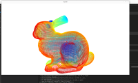

# Intro into Pointcloud processing 


## Pre-requisites

- install meshlab , cool little tool to have if you want to see the contents of the 3d mesh data
  ```
  sudo apt install meshlab
  meshlab data/bunny.ply
  ```
- python
  ```
  sudo pip3 install --upgrade pip
  sudo pip3 install open3d
  ```
- 


---


### Tutorial #1 (Really basic )

- basic_pcd_numpy_random.py , use numpy to generate a pointcloud and **render**
  - created a numpy array with 2000 points
  - dumped it into a open3d Pointcloud
  - visualize the results

    - ```

      python3 open3d/scripts/basic_pcd_numpy_random.py
      ```
- basic_pcd_io.py
  - read from a pcd/pcl
  - visualize the data on open3d visualization
  - also learn to use matplotlib to plot the same
    - ```

      ```

      python3 open3d/scripts/basic_pcd_io.py

      ```

      ```



# Requirements

- Open3D : 0.15.1
- NumPy : 1.21.6
